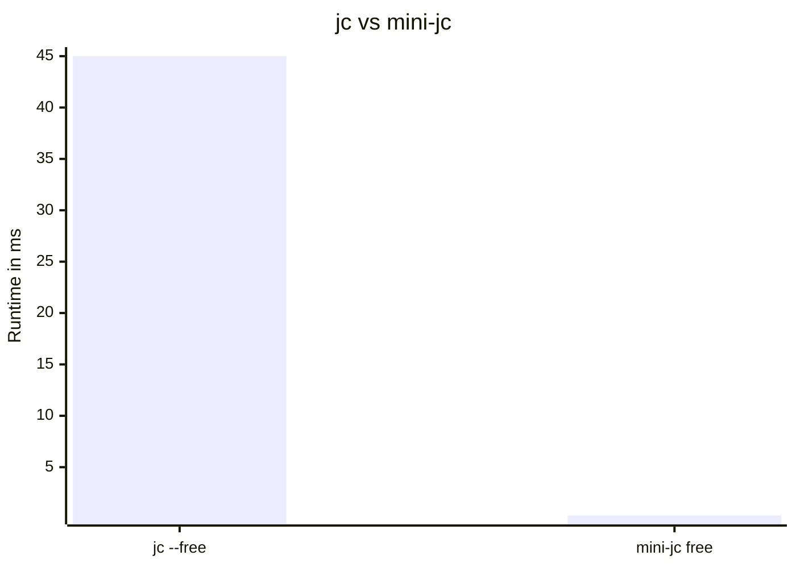

# `mini-jc`

A [jc](https://github.com/kellyjonbrazil/jc) clone with reasonable performance.

## Motivation

I use `jc` to show system stats in my taskbar on my Linux setup. Since `jc` is written in Python, it took ~50ms to spin up, parse the 3 lines of output from `free` and output it as json. I found this too slow as I have to run this every second and I don't want to give up a permanent 5% of a CPU core just to show my memory usage.

Also I was bored.

## Installation

### Using a Rust toolchain

Clone the repository and run `cargo --install --path .`.

<!-- TODO: add nix flake -->

## Differences from `jc`

- `mini-jc` is a single, statically linked executable so it is fairly to install
- `mini-jc` executes magnitudes faster than `jc`, due to not having to start up a runtime
- `mini-jc` supports way fewer parsers than `jc`. I will likely only add support for tools I use myself.

## Supported parsers

- `free`: mostly matches `jc`, but will correctly parse `-h`

## Performance

<!--
hyperfine --input test-cases/free/no-args.txt "jc --free" "target/release/mini-jc free"
-->

